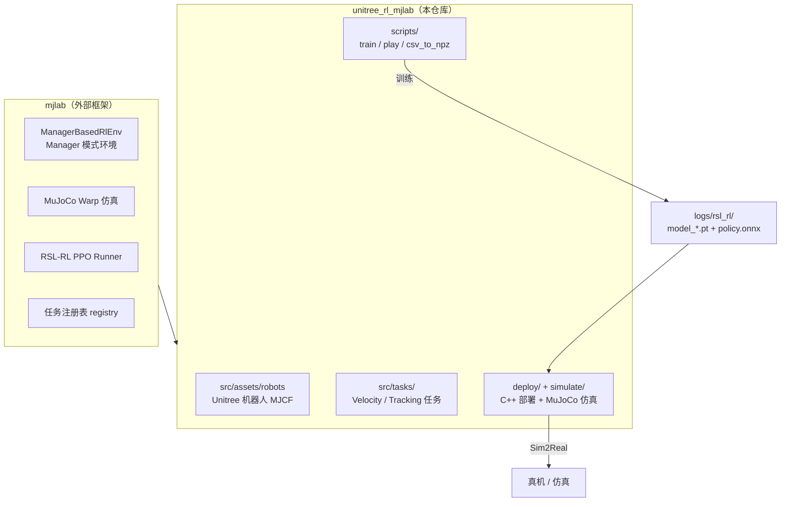
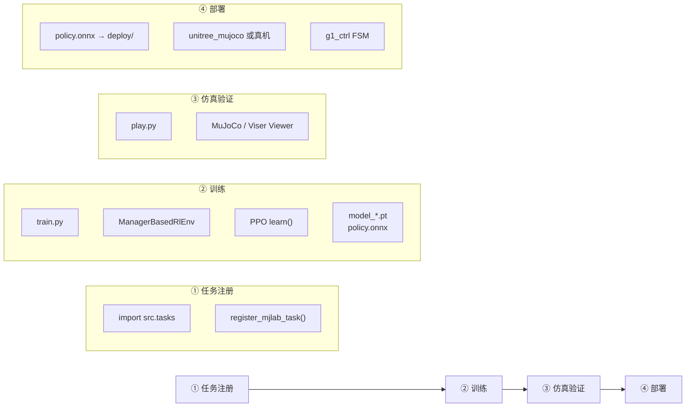
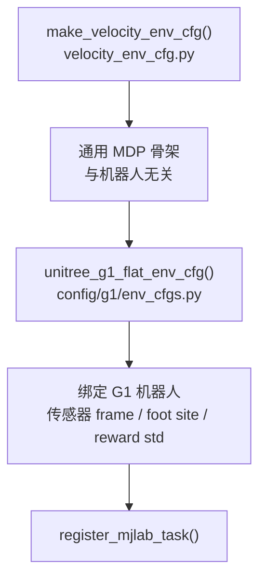
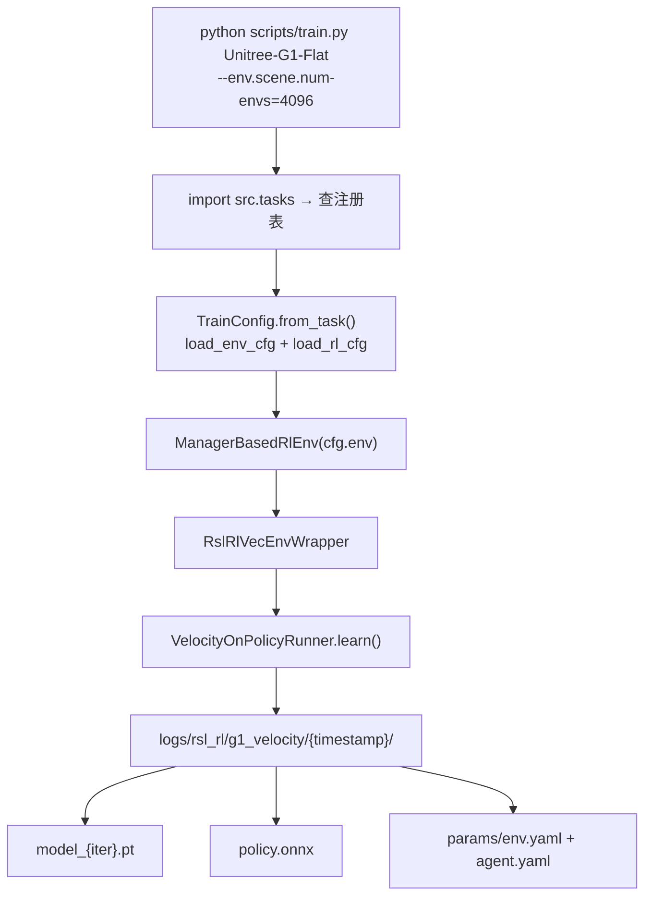
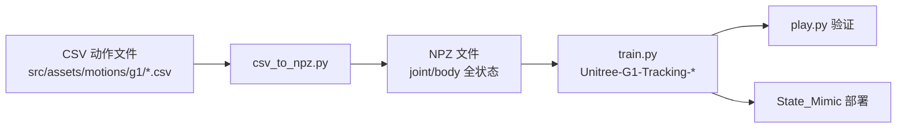
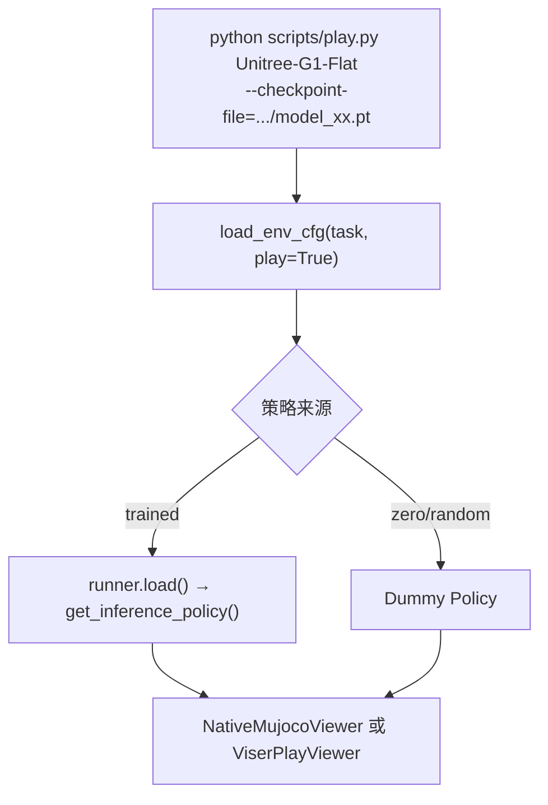
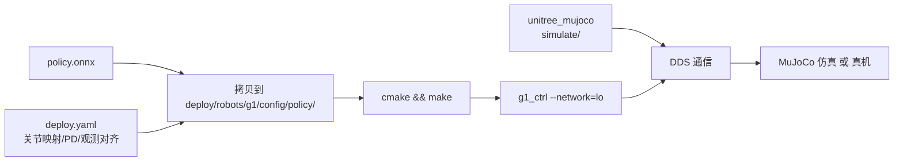

# Unitree RL Mjlab Pipeline 文档

本文档梳理 `unitree_rl_mjlab` 项目中 mjlab 的完整流水线，涵盖任务注册、训练、仿真验证与部署。

---

## 1. 整体架构

项目分两层：



**核心设计模式**：mjlab 提供通用 RL 基础设施；本仓库通过 **工厂 env_cfg → 机器人特化 → register_mjlab_task** 扩展 Unitree 任务。

---

## 2. 端到端 Pipeline



对应 README 中的流程：**训练 → 仿真验证 → 仿真到实机**。

---

## 3. 任务注册机制

### 3.1 自动导入链

```
scripts/train.py
  ├── import mjlab.tasks      # mjlab 内置任务
  └── import src.tasks        # 触发 Unitree 任务注册
        └── src/tasks/__init__.py
              └── import_packages() 递归 import 子包
                    └── src/tasks/velocity/config/g1/__init__.py
                    └── src/tasks/tracking/config/g1/__init__.py
                    └── src/tasks/amp_loco/config/g1/__init__.py   # AMP（独立，可选）
```

> AMP 任务详见 [amp_zh.md](./amp_zh.md)。Velocity、Tracking、AMP 均通过
> `src/rsl_rl/` 使用本地 vendored RSL-RL 5.x，无需切换依赖。

### 3.2 每个 Task 注册 4 项

以 `Unitree-G1-Flat` 为例（`src/tasks/velocity/config/g1/__init__.py`）：

```python
register_mjlab_task(
  task_id="Unitree-G1-Flat",
  env_cfg=unitree_g1_flat_env_cfg(),
  play_env_cfg=unitree_g1_flat_env_cfg(play=True),
  rl_cfg=unitree_g1_ppo_runner_cfg(),
  runner_cls=VelocityOnPolicyRunner,
)
```

| 字段 | 用途 |
|------|------|
| `env_cfg` | 训练环境配置 |
| `play_env_cfg` | Play 模式（更长 episode、关闭 DR 等） |
| `rl_cfg` | PPO 超参、网络结构、实验名 |
| `runner_cls` | 自定义 Runner（负责 ONNX 导出） |

### 3.3 可用任务

| 类型 | Task ID 示例 | 机器人 |
|------|-------------|--------|
| **Velocity Flat** | `Unitree-G1-Flat`, `Unitree-Go2-Flat` | Go2, G1, G1-23Dof, H1_2, H2, A2, As2, R1 |
| **Velocity Rough** | `Unitree-G1-Rough` | 同上（Rough 地形） |
| **Tracking** | `Unitree-G1-Tracking-No-State-Estimation` | G1, G1-23Dof |

列出全部任务：

```bash
python scripts/list_envs.py
```

---

## 4. 环境配置分层

配置采用 **工厂 + 特化** 两层结构：



Tracking 任务同理，工厂函数为 `make_tracking_env_cfg()`（`src/tasks/tracking/tracking_env_cfg.py`）。

### 4.1 Manager 模式（Isaac Lab 风格）

`ManagerBasedRlEnv` 由多个 Manager 组成，每个 Manager 管理一组 Term：

| Manager | 职责 | Velocity 示例 |
|---------|------|---------------|
| **Scene** | 场景、机器人、地形、传感器 | G1 MJCF + 平面/粗糙地形 |
| **Command** | 训练指令生成 | `twist` 随机速度命令 |
| **Action** | 动作空间 | `joint_pos` 关节位置控制 |
| **Observation** | 观测（actor/critic 分组） | IMU、重力、关节状态、command |
| **Reward** | 奖励函数 | 速度跟踪、姿态、步态、碰撞惩罚 |
| **Termination** | 终止条件 | 超时、摔倒 |
| **Event** | 域随机化 / reset | 摩擦力、COM、push |
| **Curriculum** | 课程学习 | 速度命令范围递增 |

### 4.2 训练 vs Play 差异

| 方面 | 训练 (`env_cfg`) | Play (`play_env_cfg`) |
|------|-----------------|----------------------|
| Episode 长度 | 正常（如 20s） | 极长（≈ 无限） |
| 域随机化 | 开启 | 关闭 |
| Push 扰动 | 开启 | 关闭 |
| 观测噪声 | 开启 | 关闭 |
| Curriculum | 开启 | 关闭 |

---

## 5. 训练 Pipeline



### 5.1 关键步骤

1. **CLI 解析**：第一个参数是 `task_id`，其余通过 tyro 覆盖 `TrainConfig`（支持 `--env.*`、`--agent.*` 嵌套参数）
2. **环境构建**：向量化 MuJoCo 仿真，默认 4096 并行环境
3. **PPO 训练**：Actor-Critic MLP，收集 rollout → 更新策略
4. **保存**：每 `save_interval` 迭代保存 checkpoint，同步导出 `policy.onnx`

### 5.2 训练产物

默认保存路径：`logs/rsl_rl/<robot>_(velocity | tracking)/<date_time>/`

| 文件 | 说明 |
|------|------|
| `model_{iter}.pt` | PyTorch checkpoint |
| `policy.onnx` | 部署用 ONNX 策略（每次 save 同步导出） |
| `params/env.yaml` | 环境配置快照 |
| `params/agent.yaml` | RL 超参快照 |

### 5.3 ONNX 导出

**Velocity**（`src/tasks/velocity/rl/runner.py`）：每次 save 导出标准 `policy.onnx`，并附加 metadata。

**Tracking**（`src/tasks/tracking/rl/runner.py`）：额外导出带 motion buffer 的 ONNX，输入 `obs + time_step`，输出 actions + 参考动作。

### 5.4 多 GPU 训练

```bash
python scripts/train.py Unitree-G1-Flat \
  --gpu-ids 0 1 \
  --env.scene.num-envs=4096
```

通过 `torchrunx` 启动多 worker，`LOCAL_RANK` 控制 CUDA/EGL 设备。

### 5.5 常用训练参数

| 参数 | 说明 |
|------|------|
| `--env.scene.num-envs` | 并行环境数量 |
| `--agent.max-iterations` | 最大训练迭代数 |
| `--agent.resume` | 从 checkpoint 继续训练 |
| `--agent.logger` | `wandb` 或 `tensorboard` |
| `--motion-file` | Tracking 任务必需，NPZ 动作文件路径 |

---

## 6. 动作模仿 Pipeline（Tracking）

Velocity 之外还有一条 **BeyondMimic 风格** 的动作跟踪链路：



### 6.1 数据预处理

```bash
python scripts/csv_to_npz.py \
  --input-file src/assets/motions/g1/dance1_subject2.csv \
  --output-name dance1_subject2.npz \
  --input-fps 30 \
  --output-fps 50 \
  --robot g1
```

NPZ 默认保存路径：`src/assets/motions/g1/`

NPZ 包含字段：`fps`, `joint_pos`, `joint_vel`, `body_pos_w`, `body_quat_w`, `body_lin_vel_w`, `body_ang_vel_w`

### 6.2 训练

```bash
python scripts/train.py Unitree-G1-Tracking-No-State-Estimation \
  --motion-file=src/assets/motions/g1/dance1_subject2.npz \
  --env.scene.num-envs=4096
```

`MotionCommand`（`src/tasks/tracking/mdp/commands.py`）加载 NPZ，按 time step 提供参考动作。

---

## 7. 仿真验证 Pipeline（Play）



### 7.1 Viewer 选择

| 模式 | 说明 |
|------|------|
| `native` | 本地有 DISPLAY 时使用，MuJoCo 原生窗口 |
| `viser` | 无显示器时使用，Web 3D 可视化 |
| `auto` | 自动选择（默认） |

### 7.2 示例命令

```bash
# 速度跟踪
python scripts/play.py Unitree-G1-Flat \
  --checkpoint-file=logs/rsl_rl/g1_velocity/2026-xx-xx_xx-xx-xx/model_xx.pt

# 动作模仿
python scripts/play.py Unitree-G1-Tracking-No-State-Estimation \
  --motion-file=src/assets/motions/g1/dance1_subject2.npz \
  --checkpoint-file=logs/rsl_rl/g1_tracking/2026-xx-xx_xx-xx-xx/model_xx.pt
```

---

## 8. 部署 Pipeline（Sim2Real）



### 8.1 训练产物 → 部署配置

将 `policy.onnx` 拷贝到对应目录，例如：

```
deploy/robots/g1/config/policy/velocity/v0/exported/policy.onnx
deploy/robots/g1/config/policy/mimic/dance1_subject2/exported/*.onnx
```

`deploy.yaml` 定义关节映射、PD 增益、观测项、动作 scale/offset，需与训练 obs/action 对齐。

### 8.2 C++ 控制架构

```
main.cpp
  → Unitree SDK2 DDS 初始化
  → CtrlFSM (有限状态机)
      ├── Passive        零力矩
      ├── FixStand       固定站立
      ├── State_RLBase   速度 RL 控制（ONNX 推理）
      └── State_Mimic    动作模仿（NPZ + ONNX）
```

运行时：`isaaclab::ManagerBasedRLEnv`（C++ 侧，与 Python 训练 obs 对齐）+ `OrtRunner`（ONNX Runtime 推理）。

### 8.3 编译

```bash
# 控制程序
cd deploy/robots/g1
mkdir build && cd build
cmake .. && make

# MuJoCo 仿真器
cd simulate
mkdir build && cd build
cmake .. && make -j8
```

### 8.4 Sim2Sim（仿真部署）

```bash
# 终端 1：启动 MuJoCo 仿真（需连接手柄）
./simulate/build/unitree_mujoco

# 终端 2：启动控制程序
./deploy/robots/g1/build/g1_ctrl --network=lo
```

可在 `simulate/config.yaml` 中选择对应机器人场景。

### 8.5 Sim2Real（实物部署）

1. 机器人吊装启动，进入零力矩模式
2. 按 `L2+R2` 进入调试模式
3. 网线连接，电脑 IP 设为 `192.168.123.222`
4. 启动控制程序：

```bash
./deploy/robots/g1/build/g1_ctrl --network=enp5s0
```

`network` 参数为连接机器人的网卡名（`ifconfig` 查看）；仿真用 `lo`，真机如 `enp5s0`。

### 8.6 支持的 deploy 机器人

`g1`, `g1_23dof`（含 Mimic）, `go2`, `h1_2`, `r1`, `a2`

---

## 9. 目录结构

```
unitree_rl_mjlab/
├── scripts/
│   ├── train.py          # 训练入口
│   ├── play.py           # 评估/可视化
│   ├── csv_to_npz.py     # 动作预处理
│   └── list_envs.py      # 列出任务
├── src/
│   ├── assets/
│   │   ├── robots/       # 各机器人 MJCF + get_*_robot_cfg()
│   │   └── motions/      # CSV/NPZ 动作文件
│   └── tasks/
│       ├── velocity/     # 速度跟踪
│       │   ├── velocity_env_cfg.py   # 工厂函数
│       │   ├── mdp/                  # 奖励/观测/命令
│       │   ├── config/{robot}/       # 各机器人特化
│       │   └── rl/runner.py          # ONNX 导出
│       └── tracking/     # 动作模仿（结构类似）
├── deploy/
│   ├── include/          # FSM 状态机
│   └── robots/{g1,go2,...}/  # 各机器人 C++ 控制
├── simulate/             # MuJoCo + SDK2 桥接
├── doc/                  # 文档
└── logs/rsl_rl/          # 训练输出（运行时生成）
```

---

## 10. 配置文件模式

### 10.1 `velocity_env_cfg.py` — 工厂模式

路径：`src/tasks/velocity/velocity_env_cfg.py`

`make_velocity_env_cfg()` 定义与机器人无关的 velocity 任务骨架（Scene、Observations、Commands、Actions、Rewards、Events、Curriculum 等）。

### 10.2 机器人 `env_cfgs.py` — 特化层

路径示例：`src/tasks/velocity/config/g1/env_cfgs.py`

```python
cfg = make_velocity_env_cfg()
cfg.scene.entities = {"robot": get_g1_robot_cfg()}
# 绑定传感器 frame、foot site、reward std、自碰撞 sensor ...
if play:
    cfg.episode_length_s = int(1e9)
    # 关闭 DR、push、curriculum ...
```

Flat 版继承 Rough，改 plane 地形、去掉 height_scan。

### 10.3 `rl_cfg.py` — Runner 超参

路径示例：`src/tasks/velocity/config/g1/rl_cfg.py`

统一结构 `RslRlOnPolicyRunnerCfg`：

- `actor` / `critic`：`RslRlModelCfg(hidden_dims, activation, obs_normalization)`
- `algorithm`：`RslRlPpoAlgorithmCfg`（PPO 超参）
- `experiment_name`：决定日志目录（如 `g1_velocity`, `g1_tracking`）
- `num_steps_per_env`, `max_iterations`, `save_interval`

### 10.4 MDP 扩展

| 任务 | 本地 MDP | 路径 |
|------|----------|------|
| Velocity | 奖励/观测/curriculum/velocity_command | `src/tasks/velocity/mdp/` |
| Tracking | MotionCommand、tracking 奖励/终止 | `src/tasks/tracking/mdp/` |

两者均 `from mjlab.envs.mdp import *` 再叠加本地扩展。

---

## 11. 命令速查

```bash
# 激活环境（若使用 conda）
conda activate unitree_rl_mjlab
env -u PYTHONPATH   # 清除 IsaacLab PYTHONPATH 污染

# 列出任务
python scripts/list_envs.py

# ── 速度跟踪 ──
python scripts/train.py Unitree-G1-Flat \
  --env.scene.num-envs=4096 \
  --agent.logger=tensorboard

python scripts/play.py Unitree-G1-Flat \
  --checkpoint-file=logs/rsl_rl/g1_velocity/.../model_xx.pt

# ── 动作模仿 ──
python scripts/csv_to_npz.py --robot g1 \
  --input-file src/assets/motions/g1/dance1_subject2.csv \
  --output-name dance1_subject2.npz

python scripts/train.py Unitree-G1-Tracking-No-State-Estimation \
  --motion-file=src/assets/motions/g1/dance1_subject2.npz

# ── 部署 ──
cd deploy/robots/g1 && mkdir build && cd build && cmake .. && make
cd simulate && mkdir build && cd build && cmake .. && make -j8
./simulate/build/unitree_mujoco
./deploy/robots/g1/build/g1_ctrl --network=lo
```

---

## 12. 数据流总结

```
机器人 MJCF (src/assets/robots/)
    ↓
env_cfgs.py 绑定机器人 + 特化 MDP
    ↓
register_mjlab_task() 注册到 mjlab registry
    ↓
train.py → ManagerBasedRlEnv → PPO → model_*.pt + policy.onnx
    ↓
play.py  MuJoCo/Viser 可视化验证
    ↓
deploy/  ONNX + deploy.yaml → C++ FSM → DDS → 真机/仿真
```

---

## 13. 相关文档

- [安装配置](setup_zh.md)
- [README](../README_zh.md)
- [mjlab 官方文档](https://mujocolab.github.io/mjlab/index.html)
- [BeyondMimic 动作预处理](https://github.com/HybridRobotics/whole_body_tracking/blob/main/README.md#motion-preprocessing--registry-setup)
